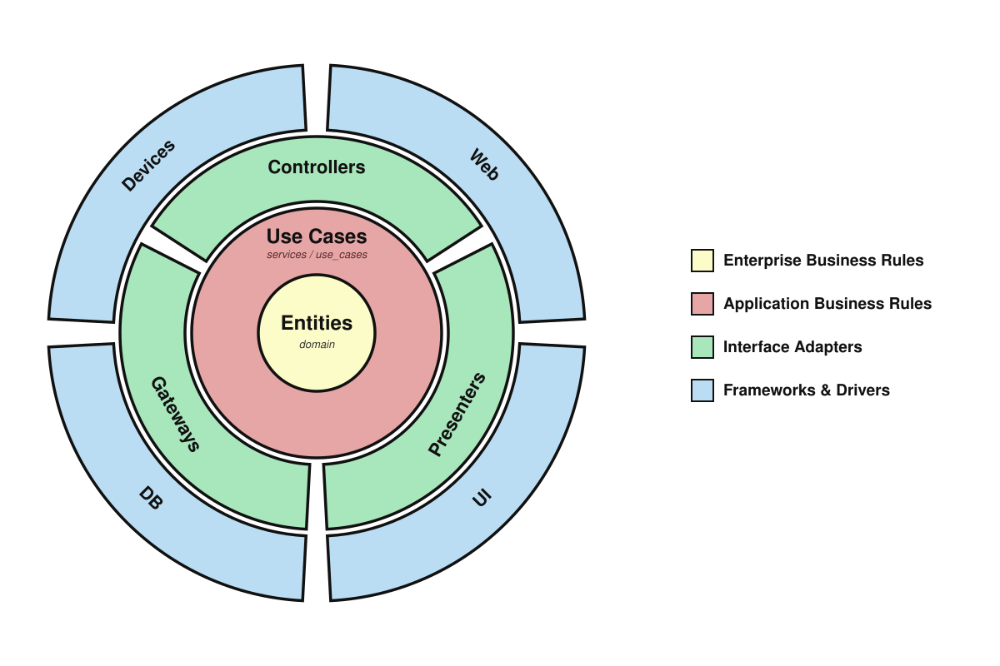

# crew-rs

A live TUI over registered agent sessions.

## 1. Architecture



CLEAN code is organized in concentric layers and dependencies 
point inwards, whilst control flows outward at runtime. 
This means an inner layer never imports 
an outer one. Domain entities knows nothing about the
external drivers or frameworks that power the application.

```
domain          ← pure business entities
services        ← application layer: use cases + ports (domain aware)
adapters        ← concrete IO (implements ports)
frameworks/ui   ← ui/ratatui rendering + input (outermost)

use_case  ──calls──▶  port (trait)  ◀──implements──  adapter
```

- **domain** — the business entities and rules that are true regardless of how 
the app is delivered. If it needs the outside world, it doesn't belong here.

- **services** — the application layer. It abstracts away *how* an operation is
  carried out from both the domain and the external interface. Split in two:
  - **ports** — interface definitions: a use-case's abstract need for the outside
    world, on its own terms. Virtual interfaces only. Because the port belongs 
    to the inner layer, a use case can be exercised against an in-memory fake adapter.
  - **use_cases** — orchestration: compose domain entities and call ports to
    fulfill one intent. Depend only on ports, never on concrete IO.

- **adapters** — concrete implementations of the ports. Driver/Secondary
  adapters implement a port that a use-case needs. Driving/Primary adapters 
  drive the use-cases themselves, taking an input, calling a use-case, and 
  presenting the result. A driving adapter is realized by three roles:
  - **controller** — the input half: translates an incoming event/request into
    a use-case call. Owns no business rules; it only routes intent inward.
  - **presenter** — the output half: maps a use-case result into a view-model
    shaped for one medium. Formatting only (labels, symbols, colors) — never
    business logic, so a single state can drive many presenters.
  - **view** — renders the presenter's view-model into concrete output. It only
    displays what the presenter already prepared; it makes no decisions.

- **frameworks** — the outermost layer: renders sessions a use case returns and
  maps key presses to use-case calls. Ratatui lives *here only*, consumed 
  concretely, never hidden behind a trait.

## 2. Package & Layout

Built on: 

- [ratatui](https://ratatui.rs)
- [crossterm](https://crates.io/crates/crossterm)

```
src/
├── domain/                 # agent.rs, session.rs, registry.rs
│   └── mod.rs
├── services/               # the application layer
│   ├── mod.rs
│   ├── ports/              # registry_repository.rs, state_store.rs, multiplexer.rs
│   └── use_cases/          # list_sessions.rs, jump_to_session.rs, …
├── adapters/               # fs_registry.rs, fs_state.rs, tmux.rs
└── ui/                     # ratatui
```

## 3. Getting Started

```bash
cargo build --release
cargo run --release
```

## References

- `~/.tmux.conf` — how crew surfaces today (the `crew` key-table + status line)
- `~/.config/crew/` — the bash tool being ported (registry, state, signal/render)
- a private ratatui dashboard project — the TUI architecture this is modeled on
